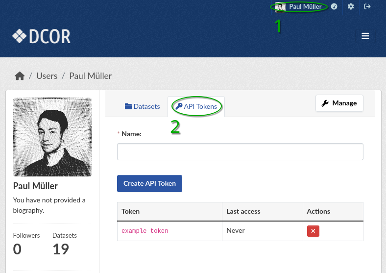

==========================
Frequently Asked Questions
==========================

.. _sec_faq_help:

I need help with something that's not covered here
==================================================

If you found a bug, have a feature request, or have any other question
regarding DCOR, please open an issue in the DCOR repository that in your
opinion best matches your query:

https://github.com/DCOR-dev

If in doubt, please create an issue in the
`DCOR-help <https://github.com/DCOR-dev/DCOR-help/issues>`__ repositry.

.. _sec_faq_api_token:

What is an API token and where do I find mine?
==============================================
Whenever you would like to access DCOR via a software such as DCOR-Aid
or a custom script, you need an API token (formerly known as API key).
If you selected the "Playground" option in DCOR-Aid, an API token is
automatically generated for you and stored by DCOR-Aid. If you are
using another DCOR instance, you have to manually create an API token by
logging in, navigating to your user profile and selecting "API Tokens"
(:numref:`fig_generate_api_token_web`).

.. note::

    An API token is only ever valid for one DCOR instance. If you selected
    the "Playground" option in DCOR-Aid, you are logged in at
    https://dcor-dev.mpl.mpg.de. The main DCOR instance, however, is
    located at https://dcor.mpl.mpg.de.

.. _fig_generate_api_token_web:

    Generating an API token via the web interface.

.. _sec_faq_upload_license:

Why do I have to specify a creative commons license when uploading data?
========================================================================
This is a choice made by design. For all data that you upload, private or
public, you must specify a creative commons license. This ensures that
the data can be used by others in the future. DCOR is a free service
hosted by an organization serving the public good. If you cannot meet
those terms, then you still have the option to host your own DCOR instance
(see :ref:`selfhost`).

.. _sec_faq_upload_test:

Can I upload a test dataset somewhere?
======================================
For all testing (or development) purposes, you can use the development
instance at https://dcor-dev.mpl.mpg.de. All datasets on that server are
purged on a regular basis, so feel free to play with it as you see fit.

.. _sec_faq_upload_background:

What happens in the background when I upload a dataset?
=======================================================
For every DC file that you upload, DCOR performs the following tasks in
the background:

- Generate a condensed version of the original data. This computationally
  expensive task is necessary to provide fast access to ancillary features,
  such as volume or principal inertia ratio, to DCscope or dclab via the
  DCOR API. It also allows you to only upload the data you actually recorded
  (without any disadvantages).
- Generate a preview image and extract the configuration for visualization
  of the data in the web interface.
- The original file you uploaded is not changed. You can verify that the
  uploaded file is identical to the original file on your hard disk by
  comparing their sha256 sums. The sha256 sum is listed on each resource
  page under Additional Information.

Please note that, due to this data processing, it may take a few minutes
until the preview is visible and the ancillary features are available via
the DCOR API. 

.. _sec_faq_dataset_not_editable:

Why can't I add resources to existing datasets?
===============================================
Not being able to modify a finalized dataset is part of the design of DCOR.
The idea behind this design choice is that any user who uses a dataset
(e.g. for a publication) will always work with the same resources. If you would
be able to add resources (or even replace them), then this would
impair reproducibility (or at least make things intransparent).

When you upload several resources in a dataset via DCOR-Aid, the DCOR-Aid
first creates a *draft* dataset. When a dataset is a *draft*, resources
may be uploaded and metadata may be edited. After the upload is complete,
DCOR-Aid sets the state of the dataset (irreversibly) to *active*. In the
active state, only the following actions are allowed:

1. setting the visibility of a private dataset to public
2. changing the license of a dataset to a less restrictive one

.. _sec_faq_dataset_not_deletable:

Why can't I delete datasets or resources?
=========================================
Here, the same arguments about :ref:`prohibiting the addition of resources
to active datasets <sec_faq_dataset_not_editable>` apply. Scientific data
that once have been made available to the public should not be taken down again.

There are exceptions, for instance:

- The data are from a blood measurement of a patient at a hospital. The patient
  never gave consent for his/her data being made publicly available or the
  patient revoked a corresponding license.
- You have uploaded a dataset that contains sensitive patient data that could
  possibly be used to deanonymize the patient.

In such cases, it is possible to delete entire datasets. However, this procedure
requires you to make a clear statement and proviee proof for your claims.

.. _sec_faq_license_list:

Which licenses can I use for my data?
=====================================
Each DCOR server has a custom list of licenses from which a user may choose.
The main DCOR instance supports the most popular
`creative commons licenses <https://creativecommons.org/share-your-work/cclicenses/>`_.
The DCOR-Aid graphical user interface will allow you to select a license from
a list. If you would like to automate uploading via dcoraid task files, you can
get a list of licenses with the following Python command. If you are creating a
dcoraid task, you must specify the license identifier (``id``), e.g. "CC0-1.0".

.. note::

   Please ignore the license with the identifier "none". It is used
   for internal datasets and for testing user permissions.

.. ipython::

   In [1]: from dcoraid.api import CKANAPI

   In [2]: api = CKANAPI("dcor.mpl.mpg.de")

   In [3]: api.get_license_list()
   Out[6]:
   [{'domain_content': False,
     'domain_data': False,
     'domain_software': False,
     'family': '',
     'id': 'none',
     'maintainer': 'Unknown',
     'od_conformance': 'not approved',
     'osd_conformance': 'not reviewed',
     'status': 'active',
     'title': 'Not specified',
     'url': ''},
    {'domain_content': True,
     'domain_data': True,
     'domain_software': True,
     'family': '',
     'id': 'CC0-1.0',
     'maintainer': 'Creative Commons',
     'od_conformance': 'approved',
     'osd_conformance': 'not reviewed',
     'status': 'active',
     'title': 'Creative Commons Public Domain Dedication',
     'url': 'https://creativecommons.org/publicdomain/zero/1.0/'},
    {'domain_content': True,
     'domain_data': True,
     'domain_software': False,
     'family': '',
     'id': 'CC-BY-4.0',
     'maintainer': 'Creative Commons',
     'od_conformance': 'approved',
     'osd_conformance': 'not reviewed',
     'status': 'active',
     'title': 'Creative Commons Attribution 4.0',
     'url': 'https://creativecommons.org/licenses/by/4.0/'},
    {'domain_content': True,
     'domain_data': True,
     'domain_software': False,
     'family': '',
     'id': 'CC-BY-SA-4.0',
     'maintainer': 'Creative Commons',
     'od_conformance': 'approved',
     'osd_conformance': 'not reviewed',
     'status': 'active',
     'title': 'Creative Commons Attribution Share-Alike 4.0',
     'url': 'https://creativecommons.org/licenses/by-sa/4.0/'},
    {'domain_content': True,
     'domain_data': True,
     'domain_software': False,
     'family': 'Creative Commons',
     'id': 'CC-BY-NC-4.0',
     'maintainer': 'Creative Commons',
     'od_conformance': 'rejected',
     'osd_conformance': 'not reviewed',
     'status': 'active',
     'title': 'Creative Commons Attribution-NonCommercial 4.0',
     'url': 'https://creativecommons.org/licenses/by-nc/4.0/'}]
