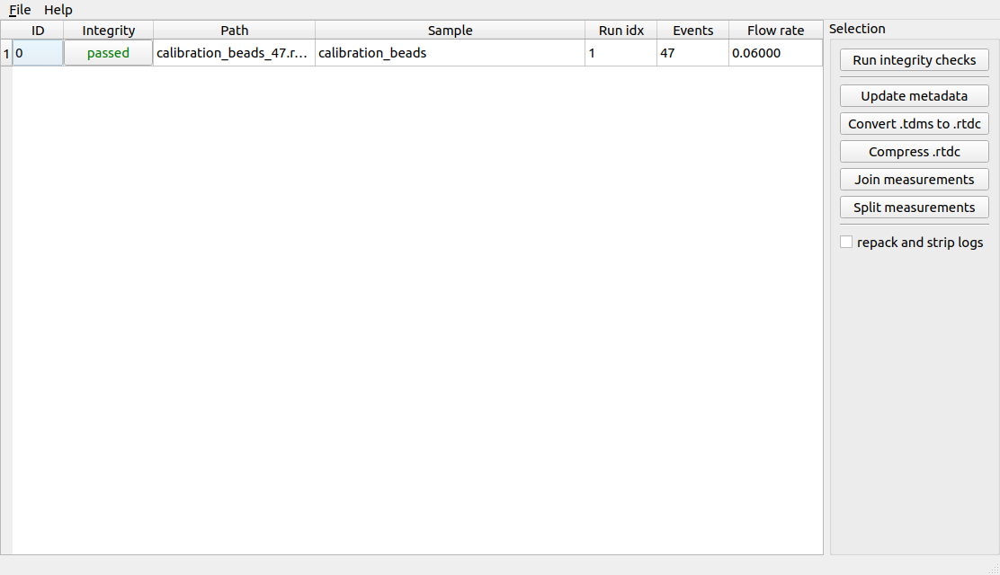
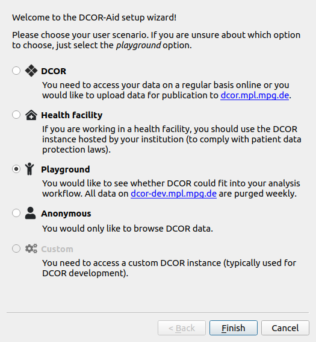
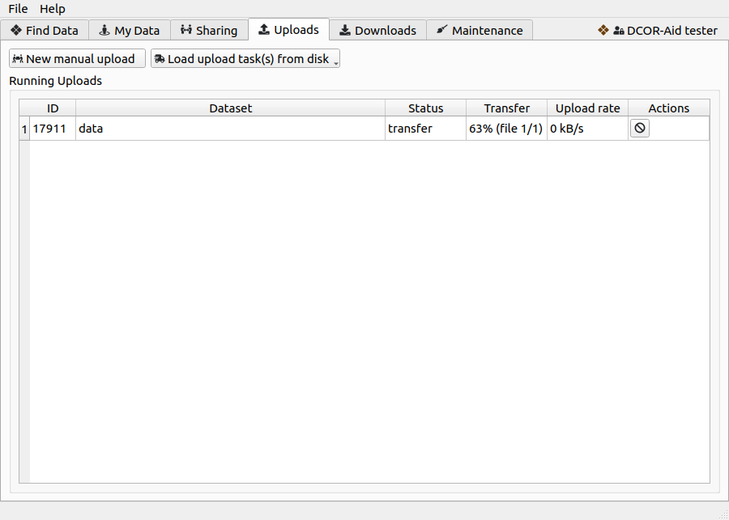

.. _sec_upload:

======================
Uploading data to DCOR
======================

.. _sec_upload_prerequisites:

Prerequisites
=============
- DCKit: graphical toolkit for the management of RT-DC data
  (https://github.com/ZELLMECHANIK-DRESDEN/DCKit/releases)
- DCOR-Aid: GUI for managing data on DCOR
  (https://github.com/DCOR-dev/DCOR-Aid/releases)

.. _sec_upload_preparation:

Data preparation with DCKit
===========================
In many cases, you should not upload your experimental data right away
to DCOR. There may be several reasons for that, such as missing metadata,
uncompressed raw data, or log files that contain sensitive or unnecessary
information (such as the user name of the person that recorded or processed
the raw data). Please also note that DCOR only works with DC data in the HDF5
file format (.rtdc file extension).

DCKit to the rescue! In most cases, it is sufficient to to run your data
through DCKit. Load the files in question, run the integrity check,
complete or correct any missing or bad metadata keys and either convert
the data to the .rtdc file format (for tdms data) or compress the data.
You can verify that everything went as intended by running the integrity
check for the newly generated files. If you are certain that you are not
losing valuable information, you may also use the *repack and strip logs* option.

    DCKit user interface with one .rtdc file loaded that passed all
    integrity checks. DCKit can perform various tasks that are represented
    by the tool buttons on the right. Before uploading to DCOR, it is
    recommended to at least update the metadata such that the integrity
    checks pass.

.. _sec_upload_dcoraid:

Data upload with DCOR-Aid
=========================

    The DCOR-Aid setup wizard guides you through the initial setup.

To upload your data to a DCOR instance, you first need to create an account.
When you start DCOR-Aid for the first time, you will be given several
options.

- If you select "Playground", DCOR-Aid will create a testing account
  at https://dcor-dev.mpl.mpg.de for you. All data on that **dev**\elopment
  is pruned weekly. You can use the DCOR-dev instance for testing.

- If you select "DCOR", you will have to manually `register at dcor.mpl.mpg.de
  <https://dcor.mpl.mpg.de/user/register>`_ and generate an API key for DCOR-Aid
  in the DCOR web interface.

You can always run the setup wizard again via the *File* menu to e.g. switch
from "playground" to the production DCOR server.

Once DCOR-Aid is connected to a DCOR instance, go to the *Upload* tab.
The *New manual upload* tool button directs you to the metadata entry and
resource selection process. It is also possible to upload pre-defined
upload tasks (see next section).

    The upload tab gives you the option to manually upload datasets or
    to load auto-generated DCOR-Aid upload task (.dcoraid-task) files via
    the buttons at the top.
    Queued and running uploads are then displayed in the table below.

.. _sec_upload_generate_dcoraid_task:

Generating DCOR-Aid upload tasks
================================
If you need a way to upload many datasets in an automated manner
you can make use of .dcoraid-task files. These files are essentially
upload recipes that can be loaded into DCOR-Aid in the *Upload* tab
via the *Load upload task(s) from disk* tool button.

The following script :download:`upload_task_generation.py` recursively
searches a directory tree for .rtdc files and generates .dcoraid-task files.

.. literalinclude:: upload_task_generation.py
  :language: python

